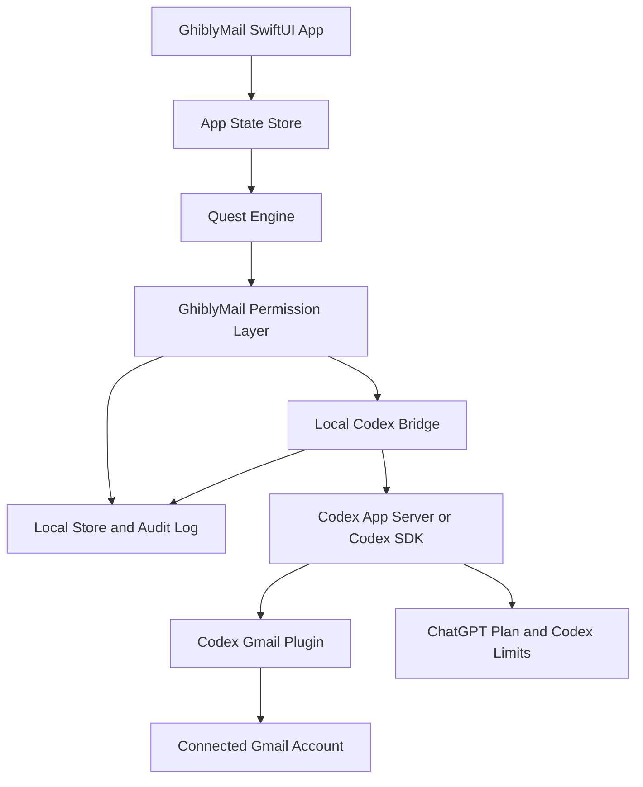

# Codex And Gmail Integration Plan

Status: Draft

Last reviewed: 2026-05-26

## Decision

Use the local Codex installation as the primary AI runtime for the first real Gmail experiments.

The current machine has:

- Codex CLI installed at `/opt/homebrew/bin/codex`.
- Codex version `0.128.0`.
- ChatGPT-managed Codex login on a Pro plan.
- `gmail@openai-curated` installed and enabled.

This replaces the earlier OpenClaw exploration path. GhiblyMail should not shell out to OpenClaw for the MVP.

## Target Architecture



## Integration Surfaces

Preferred implementation order:

1. `codex app-server` over stdio or a Unix socket.
2. Codex TypeScript SDK from a local Node helper if it proves simpler than direct JSON-RPC.
3. `codex exec` only for manual spikes and debugging.

The SwiftUI app should not parse terminal UI output as a production interface. A small local helper process can own the Codex protocol details and expose a narrow interface to Swift.

## Safety Boundary

Codex can reason about Gmail, but GhiblyMail owns the product permission model.

Rules:

- No unattended Codex turn may send email.
- No Gmail write should run unless GhiblyMail has a matching approved action.
- Codex output must be treated as proposals, not commands.
- App-server approval events for connector/tool actions must be routed into GhiblyMail UI or declined by default.
- Email bodies, calendar invites, attachments, unsubscribe pages, and research pages are untrusted input.
- Prompt-injection tests must pass before live Gmail writes are enabled.

## First Spike

Goal: prove that Codex plus the Gmail plugin can turn a small inbox slice into GhiblyMail quests without modifying Gmail.

Scope:

- Read a limited set of recent unread or inbox threads.
- Ask Codex to return structured JSON only.
- Classify each thread as actionable, waiting, FYI, cold outreach, mailing list, calendar invite, or unclear.
- Produce draft text only as local proposal data.
- Do not create Gmail drafts.
- Do not move labels.
- Do not unsubscribe.
- Do not send.

Expected output shape:

```json
{
  "quests": [
    {
      "threadId": "provider-thread-id",
      "category": "needs_reply",
      "title": "Short user-facing task title",
      "summary": "One concise paragraph",
      "proposedAction": "draft_reply",
      "requiresUserInput": false,
      "riskLevel": "low",
      "evidence": ["brief non-secret rationale"]
    }
  ]
}
```

## Fallback Path

If Codex plugin access is too hard to package, too broad for safety, or unavailable outside this development machine, the fallback is a direct Gmail API connector plus an abstract `AgentRuntime`.

That fallback would require:

- Google OAuth app setup.
- Restricted Gmail scope review.
- Keychain token storage.
- Direct Gmail API operations for read, draft, label, and send.
- Either OpenAI API billing, a local model, or another supported agent runtime.

The fallback remains a design option, but it is no longer the first implementation path.
