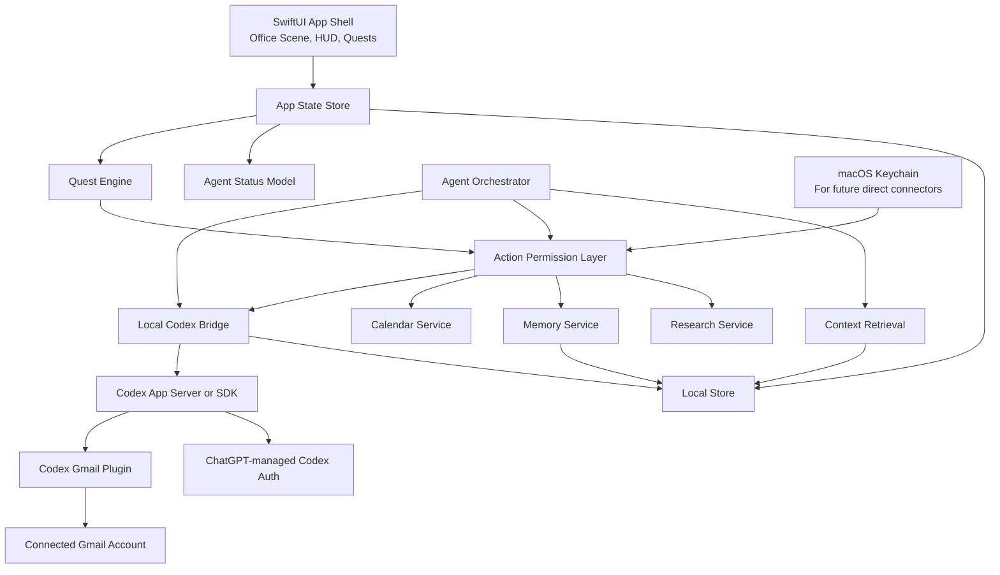

# GhiblyMail Technical Architecture

Status: Draft

## Architecture Goals

GhiblyMail should be built as a secure, local-first macOS desktop app that can eventually support iOS and iPadOS. The first implementation should prove the product experience with mock data, then connect to Gmail through the local Codex installation and the installed Codex Gmail plugin.

Primary goals:

- Native-feeling macOS app.
- Calm, game-like command-center interface.
- Local-first email index, memory, draft, and task storage.
- Strong permission boundary around all AI-proposed actions.
- Codex-first Gmail integration that starts with no-write read/proposal mode and expands gradually.
- Agent architecture that can evolve without rewriting the UI.

## Recommended Stack

Initial recommendation:

- Language: Swift.
- UI: SwiftUI.
- App target: macOS first.
- Future portability: shared Swift package modules for core logic that can later be reused by iOS and iPadOS apps.
- Local secure credential storage: Keychain Services.
- Local app storage: SQLite or SwiftData, with the final choice made during implementation.
- Large local document storage: app support directory, with encrypted storage for sensitive data.
- Background work: Swift concurrency.
- Local AI/runtime bridge: Codex app-server or the Codex SDK, called through a small local helper process if needed.
- Gmail connector for initial live experiments: installed Codex Gmail plugin.

Rationale:

- Native macOS gives better access to Apple security primitives, app signing, notarization, sandboxing, Keychain, notifications, and future iOS/iPadOS reuse.
- SwiftUI is a good fit for the HUD, quest panels, and state-driven UI.
- A mock-data SwiftUI prototype can be built before live Gmail, Codex, or storage complexity is introduced.
- The local Codex runtime lets the app use the user's ChatGPT/Codex plan for development instead of starting with OpenAI API billing.

## High-Level Components

## Application Layers

### UI Layer

Responsibilities:

- Render the isometric office command center.
- Render HUD counters and navigation.
- Render quests and task detail views.
- Render draft approval, missing context, attachment upload, calendar invite, and triage correction flows.
- Show agent avatar status without exposing unnecessary technical logs.

Initial UI should use mock data so the product loop can be validated before connecting external services.

### App State Layer

Responsibilities:

- Maintain current UI state.
- Expose observable quest lists, HUD counts, agent statuses, and selected items.
- Avoid embedding Gmail, AI, or storage logic directly in SwiftUI views.

### Quest Engine

Responsibilities:

- Convert email threads, calendar invites, draft needs, missing attachments, and AI blockers into user-facing quests.
- Keep each quest focused on one next action.
- Track quest state: new, in progress, waiting on user, ready for approval, complete, dismissed, or failed.

### Agent Runtime

Responsibilities:

- Run or call Codex-backed agents for triage, drafting, memory updates, calendar interpretation, research, and attachment planning.
- Consume trusted instructions and untrusted email content as separate inputs.
- Return structured proposed actions, not arbitrary executable commands.
- Never execute Gmail, Calendar, filesystem, network, memory, or send actions directly.

Initial runtime decision:

- Use the local Codex installation directly.
- Prefer `codex app-server` for a rich app integration with streamed events and approval handling.
- Use the Codex TypeScript SDK from a local helper if it is simpler than managing JSON-RPC directly from Swift.
- Use `codex exec` only for manual spikes and debugging, not as the production app interface.

### Local Codex Bridge

Responsibilities:

- Own the app-server or SDK protocol details.
- Check Codex account state and surface setup problems in development builds.
- Invoke the installed Gmail plugin for Gmail-aware tasks.
- Ask Codex for structured quest, draft, and triage proposals.
- Route any Codex approval request back through the GhiblyMail permission layer.
- Persist only the minimal response data needed by the app.

The bridge should be a narrow adapter. It should not become the place where product permission logic lives.

### Permission Layer

Responsibilities:

- Validate every AI-proposed action.
- Enforce least privilege and user approval rules.
- Block actions not allowed in the current permission tier.
- Require approval for high-impact actions.
- Decline connector/tool actions unless they match an approved GhiblyMail action.
- Produce audit records for proposed, approved, rejected, executed, failed, and reversed actions.

This layer is mandatory. The AI is not the security boundary.

### Gmail Access Adapter

Responsibilities:

- Use the installed Codex Gmail plugin for the first live Gmail experiments.
- Sync Gmail metadata and message/thread bodies through the approved connector path.
- Map Gmail labels to app concepts, especially inbox and `done`.
- Create drafts in existing threads.
- Move messages to `done`.
- Send only explicitly approved drafts.

Initial implementation should start with mock data, then no-write Codex/Gmail read proposals, then drafts, then label changes, then approved send. Direct Google OAuth and direct Gmail API access are deferred unless the Codex plugin path is insufficient for packaging, safety, or product behavior.

### Calendar Service

Responsibilities:

- Detect calendar invitations.
- Maintain the unresponded invite queue.
- Support yes/no responses when permissions allow.

Calendar should be isolated from email triage so invite handling can evolve without mixing Gmail message operations and calendar write permissions.

### Memory Service

Responsibilities:

- Store user writing style summaries.
- Store contact and company notes.
- Store project and topic context.
- Store provenance and confidence for memory entries.
- Support retrieval for relevant prior threads and CRM notes.
- Let the user inspect, edit, and delete memory.

Early implementation can use Markdown documents plus a structured index. If that becomes too limiting, move to a database-backed memory model.

### Local Store

Responsibilities:

- Store mock data during early development.
- Store local email index and thread summaries.
- Store quests, draft metadata, agent statuses, and audit records.
- Store CRM memory and retrieval metadata.
- Store references to attachments and generated documents.

Sensitive local data should be encrypted at rest before live email integration.

### Research Service

Responsibilities:

- Perform optional contact or company research.
- Keep web content isolated as untrusted input.
- Avoid leaking private email content in search queries.
- Store source-aware findings only when useful and safe.

Research should be disabled in early prototypes.

## Data Model Sketch

Core entities:

- `EmailAccount`: connected Gmail identity and account settings.
- `EmailThread`: Gmail thread metadata, participants, labels, timestamps, and sync state.
- `EmailMessage`: message metadata, body reference, attachments, and trust boundary markers.
- `Quest`: user-facing task derived from email, calendar, draft, memory, or attachment state.
- `DraftReply`: proposed reply content, source thread, confidence, missing fields, and approval state.
- `AttachmentRequest`: file needed, generated content candidate, or user-upload requirement.
- `CalendarInvite`: event metadata and response state.
- `Agent`: role, avatar, current status, and allowed tools.
- `AgentActionProposal`: structured AI-proposed action.
- `AuditEvent`: action proposal, approval, execution, rejection, reversal, or failure.
- `MemoryEntry`: contact, company, project, style, or preference note with provenance and confidence.
- `TriageFeedback`: user correction and optional reason.

## Permission Tiers

Suggested implementation tiers:

1. `mock`: no external accounts, no live AI actions.
2. `codex_no_mail`: Codex available, but no Gmail connector use.
3. `codex_gmail_read`: Codex Gmail plugin may read limited mailbox slices and return proposals only.
4. `draft_local`: AI drafts stored locally only.
5. `gmail_draft`: create Gmail drafts in existing threads after approval.
6. `gmail_label`: move messages between inbox and `done` after approval or configured training-mode rules.
7. `calendar_response`: respond to calendar invites.
8. `approved_send`: send user-approved drafts.
9. `unsubscribe`: attempt safe unsubscribe flows with extra guardrails.

The app should expose current permission tier in development builds and audit logs.

## Mock Prototype Scope

The first prototype should not require live Gmail access or live Codex calls.

Mock prototype data:

- Fake inbox threads.
- Fake done messages.
- Fake AI triage results.
- Fake draft replies.
- Fake calendar invites.
- Fake missing attachment tasks.
- Fake agent statuses.
- Fake CRM snippets.

Mock prototype screens:

- Office command center.
- HUD.
- Quest board.
- Quest detail.
- Draft approval panel.
- Attachment task panel.
- Calendar invite panel.
- Triage correction flow.

## Gmail Integration Strategy

Phased approach:

1. Build mock data model and UI.
2. Add a local Codex bridge.
3. Verify the installed Codex Gmail plugin can read a limited mailbox slice.
4. Ask Codex for structured quest JSON with no Gmail writes.
5. Build local message index and threading model from approved connector output.
6. Add draft creation behind explicit user confirmation.
7. Add move-to-`done` label operations with undo.
8. Add approved send.
9. Add auto-triage only after testing and user-visible audit logs.

Direct Google OAuth remains a fallback path and may be required for packaged distribution, iOS/iPadOS, or tighter control over Gmail scopes.

## Agent Integration Strategy

Phased approach:

1. Mock agent outputs.
2. Local prompt and tool contract tests.
3. Codex bridge with account/plugin readiness checks.
4. AI-generated triage recommendations with no side effects.
5. AI-generated draft replies stored locally.
6. AI-generated Gmail drafts after approval.
7. Memory retrieval from local summaries.
8. Memory writes with provenance and review.
9. Optional research with isolated untrusted web context.

## Build And CI Strategy

Once code exists:

- Build on every pull request and push.
- Run unit tests.
- Run prompt-injection fixtures.
- Run static analysis where practical.
- Run dependency and secret scanning.
- Fail CI if generated logs or fixtures contain obvious secrets.

## Open Architecture Decisions

- Final local storage choice: SwiftData, SQLite through GRDB, Core Data, or another store.
- Whether email body storage should be fully local encrypted files, database blobs, or hybrid.
- Whether embeddings are local-only, OpenAI-hosted, or deferred.
- Whether the Codex bridge should use app-server JSON-RPC directly or a local SDK helper.
- Whether the Codex Gmail plugin path is viable for packaged distribution and later iOS/iPadOS support.
- Whether the production app has any backend service.
- How much of the isometric office scene is custom art versus code-rendered prototype assets.
